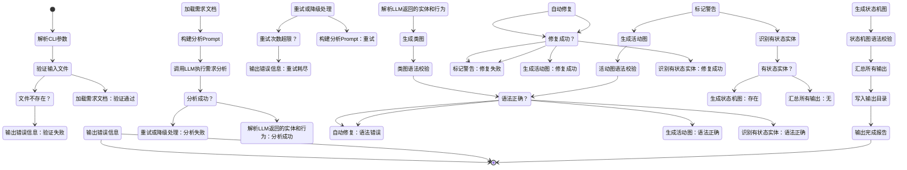
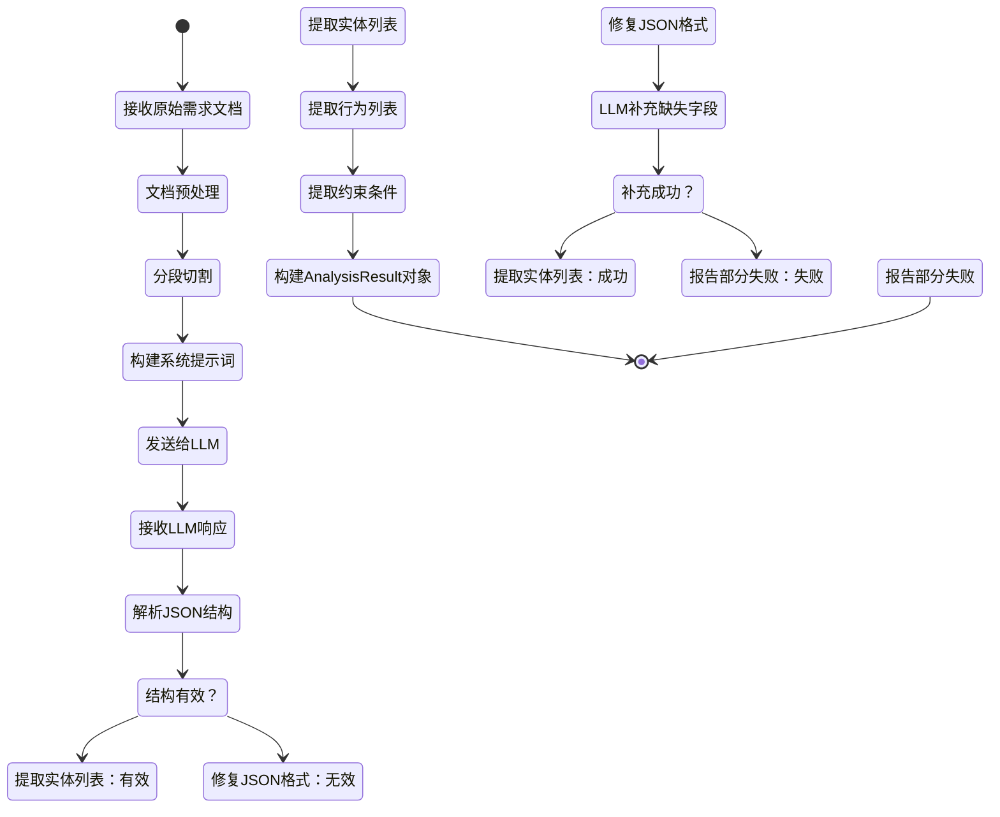
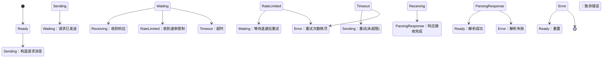

# 基于大语言模型的软件工程智能体 —— 组合a：分析+设计

## 1. 需求分析

### 1.1 项目概述

本项目构建一个面向软件工程**分析+设计**阶段的智能体系统。该智能体以自然语言描述的系统需求文档（PRD、用户故事等）为输入，利用大语言模型的语义理解与推理能力，自动生成系统分析与设计模型，辅助开发者快速从需求过渡到设计阶段。

### 1.2 功能需求

| 编号 | 需求描述 | 优先级 |
|------|----------|--------|
| FR-01 | 支持解析 Markdown、纯文本格式的需求文档/PRD | 高 |
| FR-02 | 从需求中提取关键实体、属性、关系，生成领域模型 | 高 |
| FR-03 | 自动生成 UML 类图（Mermaid classDiagram 格式） | 高 |
| FR-04 | 自动生成 UML 活动图（Mermaid flowchart/状态格式），描述核心业务流程 | 高 |
| FR-05 | 自动生成 UML 状态机图（Mermaid stateDiagram 格式），描述关键对象的状态变迁 | 中 |
| FR-06 | 支持命令行启动，指定输入文件和输出目录 | 高 |
| FR-07 | 支持用户通过 CLI 对生成结果进行补充说明和修改 | 中 |
| FR-08 | 输出格式支持 Mermaid 源码（默认）和 PlantUML（可选） | 中 |

### 1.3 非功能需求

| 编号 | 需求描述 |
|------|----------|
| NFR-01 | CLI 启动到输出完成的端到端时间不超过 60 秒（普通长度 PRD） |
| NFR-02 | 生成的 Mermaid 图表语法正确率 ≥ 90%（可被 Mermaid 渲染器正确解析） |
| NFR-03 | 支持至少 3 种不同领域（Web 应用、嵌入式系统、数据处理管线）的需求输入 |
| NFR-04 | 支持通过环境变量或配置文件切换底层大模型（如 Claude、GPT、本地模型） |

### 1.4 用例分析

```
┌─────────────────────────────────────────────────────────┐
│                    软件工程智能体系统                       │
├─────────────────────────────────────────────────────────┤
│                                                         │
│  ┌─────────┐     输入需求文档       ┌──────────────┐     │
│  │         │──────────────────────▶│              │     │
│  │  用户   │                       │  需求解析模块  │     │
│  │         │◀──────────────────────│              │     │
│  └─────────┘     输出设计产物       └──────┬───────┘     │
│                                           │             │
│                                  ┌────────▼───────┐     │
│                                  │  LLM 编排引擎   │     │
│                                  └────────┬───────┘     │
│                                           │             │
│                      ┌────────────────────┼──────┐      │
│                      │                    │      │      │
│               ┌──────▼──────┐  ┌─────────▼──┐  ┌▼──────┐│
│               │ 类图生成器   │  │活动图生成器 │  │状态机 ││
│               │             │  │            │  │图生成器││
│               └──────┬──────┘  └─────────┬──┘  └┬──────┘│
│                      │                   │       │      │
│               ┌──────▼───────────────────▼───────▼──┐   │
│               │          输出格式化模块              │   │
│               └────────────────────────────────────┘   │
└─────────────────────────────────────────────────────────┘
```

---

## 2. 系统设计

### 2.1 系统总体架构

系统采用**分层架构**，自上而下分为四层：

- **CLI 接口层**：处理命令行参数，调度任务执行
- **任务编排层**：管理 LLM 调用流程，实现提示工程策略与上下文管理
- **核心引擎层**：执行需求分析、模型生成、输出格式化
- **基础设施层**：LLM API 适配、文件 I/O、配置管理

```
┌─────────────────────────────────────────────────────┐
│                    CLI 接口层                         │
│              (argparse / click)                       │
├─────────────────────────────────────────────────────┤
│                   任务编排层                           │
│   ┌──────────┐  ┌──────────┐  ┌──────────────┐      │
│   │ 任务分解  │  │ 上下文管理│  │ 提示工程策略  │      │
│   └──────────┘  └──────────┘  └──────────────┘      │
├─────────────────────────────────────────────────────┤
│                   核心引擎层                           │
│   ┌──────────┐  ┌──────────┐  ┌──────────────┐      │
│   │ 需求分析  │  │ 类图生成  │  │ 活动图生成    │      │
│   └──────────┘  └──────────┘  └──────────────┘      │
│   ┌──────────────┐  ┌──────────────────┐            │
│   │ 状态机图生成  │  │ 输出格式化        │            │
│   └──────────────┘  └──────────────────┘            │
├─────────────────────────────────────────────────────┤
│                  基础设施层                            │
│   ┌──────────┐  ┌──────────┐  ┌──────────────┐      │
│   │ LLM 适配 │  │ 文件 I/O │  │ 配置管理      │      │
│   └──────────┘  └──────────┘  └──────────────┘      │
└─────────────────────────────────────────────────────┘
```

### 2.2 模块划分与职责

| 模块 | 职责 | 关键技术 |
|------|------|----------|
| **CLI 入口** (`cli.py`) | 解析命令行参数，验证输入，调度任务 | argparse, click |
| **任务编排器** (`orchestrator.py`) | 分解分析→设计任务链，管理多轮 LLM 对话上下文 | LangChain / 自定义编排 |
| **需求分析器** (`analyzer.py`) | 解析 PRD，提取实体、行为、约束 | LLM prompt engineering |
| **类图生成器** (`class_diagram.py`) | 生成类及其属性、方法、关系的 Mermaid 类图 | LLM + 模板校验 |
| **活动图生成器** (`activity_diagram.py`) | 生成核心业务流程的活动图 | LLM + 模板校验 |
| **状态机图生成器** (`state_machine.py`) | 生成关键对象的状态变迁图 | LLM + 模板校验 |
| **输出格式化器** (`formatter.py`) | 汇总各模块输出，生成最终的 Mermaid/PlantUML 文件 | Jinja2 模板 |
| **LLM 适配器** (`llm_adapter.py`) | 统一不同 LLM 提供商的调用接口 | anthropic SDK, openai SDK |
| **配置管理** (`config.py`) | 管理模型选择、温度、输出格式等配置 | YAML / .env |

### 2.3 类图设计

下面是智能体系统的核心类图：

```mermaid
classDiagram
    class AgentCLI {
        -Config config
        -Orchestrator orchestrator
        +main(args: list~str~) void
        +parse_args() Args
        -validate_input(path: str) bool
    }

    class Config {
        -model_name: str
        -temperature: float
        -output_format: str
        -output_dir: str
        +from_yaml(path: str) Config
        +from_env() Config
    }

    class Orchestrator {
        -LLMAdapter llm
        -RequirementAnalyzer analyzer
        -ClassDiagramGenerator class_gen
        -ActivityDiagramGenerator activity_gen
        -StateMachineGenerator state_gen
        -OutputFormatter formatter
        +run(input_doc: str) DesignOutput
        -build_context(doc: str) Context
        -handle_error(e: Exception) void
    }

    class LLMAdapter {
        -String api_key
        -String model
        -float temperature
        +chat(prompt: str, system: str) str
        +chat_with_history(messages: list) str
    }

    class RequirementAnalyzer {
        -LLMAdapter llm
        -str analysis_prompt_template
        +analyze(document: str) AnalysisResult
        -extract_entities(text: str) list~Entity~
        -extract_behaviors(text: str) list~Behavior~
        -extract_constraints(text: str) list~Constraint~
    }

    class ClassDiagramGenerator {
        -LLMAdapter llm
        -str class_prompt_template
        +generate(analysis: AnalysisResult) MermaidDiagram
        -validate_syntax(diagram: str) bool
        -fix_syntax(diagram: str) str
    }

    class ActivityDiagramGenerator {
        -LLMAdapter llm
        -str activity_prompt_template
        +generate(analysis: AnalysisResult) MermaidDiagram
        +generate_for_behavior(behavior: Behavior) MermaidDiagram
        -validate_syntax(diagram: str) bool
    }

    class StateMachineGenerator {
        -LLMAdapter llm
        -str state_prompt_template
        +generate(analysis: AnalysisResult) MermaidDiagram
        +generate_for_entity(entity: Entity) MermaidDiagram
        -identify_stateful_entities(analysis: AnalysisResult) list~Entity~
    }

    class OutputFormatter {
        -str format_type
        +format_all(analysis: AnalysisResult, ~
                    class_diagram: MermaidDiagram, ~
                    activity_diagrams: list~MermaidDiagram~, ~
                    state_diagrams: list~MermaidDiagram~) str
        +write_to_file(content: str, path: str) void
    }

    class AnalysisResult {
        +list~Entity~ entities
        +list~Behavior~ behaviors
        +list~Constraint~ constraints
        +str summary
        +dict raw_llm_output
    }

    class Entity {
        +str name
        +list~Attribute~ attributes
        +list~Method~ methods
        +list~Relationship~ relationships
    }

    class Attribute {
        +str name
        +str type
        +str visibility
    }

    class Method {
        +str name
        +list~str~ parameters
        +str return_type
        +str visibility
    }

    class Relationship {
        +str type
        +str target
        +str label
        +str multiplicity
    }

    class Behavior {
        +str name
        +str description
        +list~Step~ steps
        +list~str~ preconditions
        +list~str~ postconditions
    }

    class Step {
        +int order
        +str action
        +str actor
        +list~str~ branches
    }

    class Constraint {
        +str description
        +str type
        +str scope
    }

    class MermaidDiagram {
        +str diagram_type
        +str source_code
        +str title
        +validate() bool
        +to_file(path: str) void
    }

    class DesignOutput {
        +AnalysisResult analysis
        +MermaidDiagram class_diagram
        +list~MermaidDiagram~ activity_diagrams
        +list~MermaidDiagram~ state_diagrams
        +str generated_at
        +str input_doc_name
    }

    AgentCLI --> Config
    AgentCLI --> Orchestrator
    Orchestrator --> LLMAdapter
    Orchestrator --> RequirementAnalyzer
    Orchestrator --> ClassDiagramGenerator
    Orchestrator --> ActivityDiagramGenerator
    Orchestrator --> StateMachineGenerator
    Orchestrator --> OutputFormatter
    Orchestrator ..> DesignOutput

    RequirementAnalyzer --> LLMAdapter
    RequirementAnalyzer ..> AnalysisResult

    ClassDiagramGenerator --> LLMAdapter
    ClassDiagramGenerator ..> MermaidDiagram

    ActivityDiagramGenerator --> LLMAdapter
    ActivityDiagramGenerator ..> MermaidDiagram

    StateMachineGenerator --> LLMAdapter
    StateMachineGenerator ..> MermaidDiagram

    OutputFormatter ..> DesignOutput

    AnalysisResult *-- Entity
    AnalysisResult *-- Behavior
    AnalysisResult *-- Constraint
    Entity *-- Attribute
    Entity *-- Method
    Entity *-- Relationship
    Behavior *-- Step
```

### 2.4 活动图设计

#### 2.4.1 智能体主流程活动图



#### 2.4.2 需求分析子流程活动图



### 2.5 状态机图设计

#### 2.5.1 Orchestrator 任务编排状态机

```mermaid
stateDiagram-v2
    [*] --> Idle
    Idle --> Initializing：接收到运行指令
    Initializing --> LoadingDocument：初始化完成
    LoadingDocument --> Analyzing：文档加载成功
    LoadingDocument --> Error：文档加载失败
    
    Analyzing --> GeneratingClassDiagram：分析完成
    Analyzing --> Error：分析失败(重试耗尽)
    
    GeneratingClassDiagram --> ValidatingSyntax：类图生成完成
    GeneratingClassDiagram --> Error：生成失败
    
    ValidatingSyntax --> GeneratingActivityDiagram：校验通过
    ValidatingSyntax --> FixingSyntax：校验失败
    FixingSyntax --> GeneratingActivityDiagram：修复成功
    FixingSyntax --> GeneratingActivityDiagram：修复失败_标记警告
    
    GeneratingActivityDiagram --> ValidatingActivitySyntax：活动图生成完成
    ValidatingActivitySyntax --> CheckingStatefulEntities：校验通过/修复完成
    
    CheckingStatefulEntities --> GeneratingStateMachine：存在有状态实体
    CheckingStatefulEntities --> FormattingOutput：无有状态实体
    
    GeneratingStateMachine --> ValidatingStateSyntax：状态机图生成完成
    ValidatingStateSyntax --> FormattingOutput：校验/修复完成
    
    FormattingOutput --> WritingFiles：格式化完成
    WritingFiles --> Completed：写入成功
    WritingFiles --> Error：写入失败
    
    Completed --> [*]
    Error --> [*]
```



#### 2.5.2 LLMAdapter 调用状态机



### 2.6 数据流设计

```
┌──────────────────────────────────────────────────────────────────┐
│                         数据流总览                                │
└──────────────────────────────────────────────────────────────────┘

输入                             处理                              输出
─────                           ──────                            ──────

requirements.md ──┐                                             ┌── class_diagram.mermaid
                  │                                             │
                  ▼                                             │
          ┌───────────────┐                                     │
          │  文档预处理     │  清洗/分段                          │
          └───────┬───────┘                                     │
                  │                                             │
                  ▼                                             │
          ┌───────────────┐                                     │
          │  LLM 需求分析  │  Prompt:                            │
          │               │  "分析以下PRD，提取实体、             │
          │               │   行为、约束..."                     │
          └───────┬───────┘                                     │
                  │                                             │
                  ▼                                             │
          ┌───────────────────┐                                 │
          │  AnalysisResult   │ ─────────────────────┐          │
          │  ┌─────────────┐  │                      │          │
          │  │ entities[]  │  │                      │          │
          │  │ behaviors[] │  │                      │          │
          │  │ constraints │  │                      │          │
          │  └─────────────┘  │                      │          │
          └──────┬────────────┘                      │          │
                 │                                   │          │
     ┌───────────┼───────────┬──────────────┐        │          │
     ▼           ▼           ▼              │        │          │
┌─────────┐ ┌─────────┐ ┌──────────┐       │        │          │
│类图生成 │ │活动图   │ │状态机图  │       │        │          │
│Prompt:  │ │生成     │ │生成      │       │        │          │
│"根据实体│ │Prompt:  │ │Prompt:   │       │        │          │
│生成类图"│ │"根据行为│ │"根据实体 │       │        │          │
│         │ │生成活动 │ │生成状态机│       │        │          │
│         │ │图"      │ │图"       │       │        │          │
└────┬────┘ └────┬────┘ └────┬─────┘       │        │          │
     │           │           │              │        │          │
     ▼           ▼           ▼              │        │          │
┌─────────┐ ┌─────────┐ ┌──────────┐       │        │          │
│ Mermaid │ │ Mermaid │ │ Mermaid  │       │        │          │
│ class   │ │ state   │ │ state    │       │        │          │
│ Diagram │ │ Diagram │ │ Diagram  │       │        │          │
└────┬────┘ └────┬────┘ └────┬─────┘       │        │          │
     │           │           │              │        │          │
     └───────────┼───────────┘              │        │          │
                 │                          │        │          │
                 ▼                          ▼        │          │
          ┌──────────────────────────────────────┐  │          │
          │          OutputFormatter              │  │          │
          │  汇总所有图表 + 分析摘要               │◄─┘          │
          └────────────────┬─────────────────────┘             │
                           │                                   │
                           ▼                                   │
                    ┌──────────────┐                           │
                    │ design/ 目录  │                           │
                    │ ┌──────────┐ │                           │
                    │ │analysis  │ │◄──────────────────────────┘
                    │ │.md       │ │
                    │ │class     │ │
                    │ │.mermaid  │ │
                    │ │activity  │ │
                    │ │.mermaid  │ │
                    │ │state     │ │
                    │ │.mermaid  │ │
                    │ └──────────┘ │
                    └──────────────┘
```

### 2.7 CLI 接口设计

```bash
# 基本用法：分析需求文档，生成所有设计模型
./agent --task design --input requirements.md --output design/

# 指定只生成类图和活动图（不生成状态机图）
./agent --task design --input requirements.md --output design/ --diagrams class,activity

# 指定输出格式为 PlantUML
./agent --task design --input requirements.md --output design/ --format plantuml

# 指定使用的 LLM 模型
./agent --task design --input requirements.md --model claude-sonnet-4-6

# 非交互模式（默认），增加详细日志
./agent --task design --input requirements.md --output design/ --verbose

# 半交互模式：生成后允许用户对每个图表提出修改意见
./agent --task design --input requirements.md --output design/ --interactive
```

### 2.8 提示工程策略

| 阶段 | 提示策略 | 说明 |
|------|----------|------|
| **需求分析** | Few-shot + 结构化输出 | 在 system prompt 中提供 2-3 个分析示例，要求 LLM 以 JSON 格式返回实体、行为、约束 |
| **类图生成** | Chain-of-thought + 模板约束 | 引导 LLM 逐步推理：先确定类→再定义属性方法→最后标注关系，输出严格遵循 Mermaid classDiagram 语法 |
| **活动图生成** | 角色扮演 + 分步生成 | 让 LLM 扮演系统分析师，对每个核心行为分别生成活动图，使用 `stateDiagram-v2` 或 `flowchart` 语法 |
| **状态机图生成** | In-context learning + 自检 | 在 prompt 中提供 Mermaid stateDiagram 语法规范，生成后要求 LLM 自检语法正确性 |
| **错误恢复** | 重试 + 降级 | 语法校验失败时，将错误信息反馈给 LLM 进行修复，最多重试 3 次；超过则标记警告并输出原始结果 |

### 2.9 错误处理与重试逻辑

```
LLM 调用失败处理流程：

调用 LLM
    │
    ├── 成功 ──▶ 解析响应
    │               │
    │               ├── JSON 有效 ──▶ 继续下一步
    │               └── JSON 无效 ──▶ 重试(附带格式纠正指令)
    │
    ├── 速率限制 (429) ──▶ 指数退避等待 (1s→2s→4s→...) ──▶ 重试
    │
    ├── 服务端错误 (5xx) ──▶ 线性等待 (2s) ──▶ 重试
    │
    └── 重试次数耗尽 ──▶ 记录错误日志 ──▶ 优雅退出
```

### 2.10 上下文管理策略

由于 LLM 上下文窗口有限，采用以下策略管理长文档：

1. **文档分段**：将 PRD 按一级标题切分为逻辑段
2. **逐段分析，全局汇总**：对每段独立分析提取实体/行为，再汇总去重
3. **关键信息缓存**：将已提取的实体列表作为后续生成步骤的上下文
4. **摘要压缩**：当上下文接近窗口限制时，对已完成的分析结果做摘要压缩

---

## 3. 技术选型

| 组件 | 技术选择 | 理由 |
|------|----------|------|
| 编程语言 | Python 3.10+ | 丰富的 LLM 生态（LangChain、Anthropic SDK 等） |
| CLI 框架 | argparse / click | 标准库支持，轻量级 |
| LLM 调用 | anthropic SDK + openai SDK | 支持主流模型提供商 |
| 模板渲染 | Jinja2 | 成熟的 Python 模板引擎，用于组装最终输出 |
| 配置管理 | PyYAML | YAML 格式可读性高 |
| 测试框架 | pytest | Python 标准测试框架 |
| 输出格式 | Mermaid (默认) / PlantUML | 文本格式，易于版本管理，可被 Markdown 渲染器直接渲染 |
