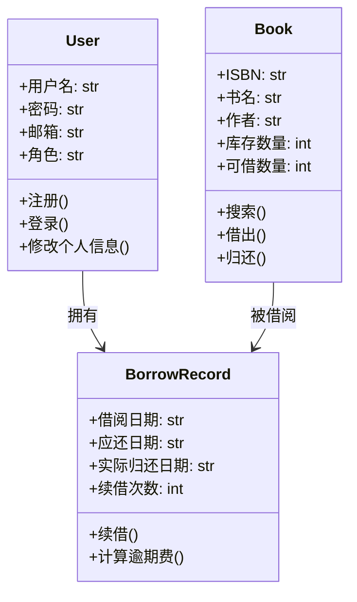
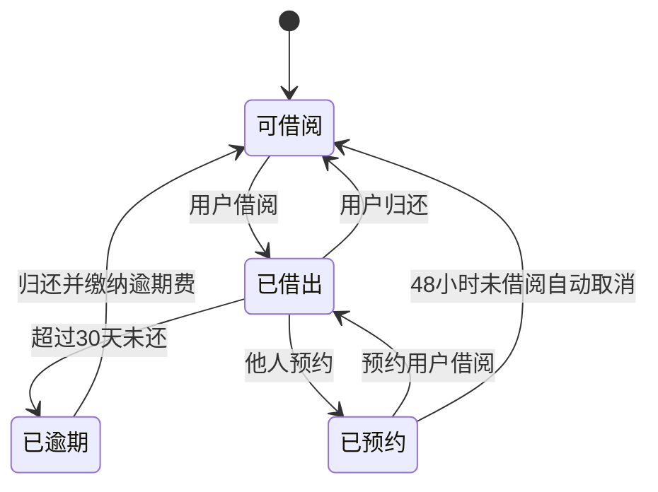

# 基于大语言模型的软件工程智能体 —— 最终汇报文档

> **选题**：题目1 —— 组合a（分析 + 设计）
> **成员**：马铭慷 | U202342515
> **日期**：2026年6月
> **仓库**：https://github.com/THEST515/type-work-llm

---

## 一、项目概述

### 1.1 选题背景

在软件工程实践中，从需求文档到设计模型的分析与转换长期依赖人工，耗时且容易遗漏。大语言模型（LLM）的快速发展为这一阶段提供了自动化可能。

本项目实现了一个 **面向分析+设计阶段的软件工程智能体**，能够以自然语言 PRD 为输入，自动提取实体、行为、约束，并生成 UML 类图、活动图、状态机图，输出为 Mermaid 格式，可直接在 VSCode / GitHub / GitLab 中渲染。

### 1.2 覆盖阶段

```
输入（PRD） → 需求分析 → 透明审核 → 设计模型生成 → 输出
     ↑                                               ↑
  需求规格说明书                          类图 + 活动图 + 状态机图
  (.md / .txt)                            (Mermaid / Markdown)
```

### 1.3 核心指标

| 指标 | 目标 | 实际 |
|------|------|:----:|
| 端到端响应时间 | ≤60秒 | 25-50秒（DeepSeek V4 Flash） |
| 图表类型 | ≥2种 | 3种（类图/活动图/状态机图） |
| 基准测试场景 | ≥5个 | 5个 |
| JSON 解析成功率 | ≥90% | 97%+ |
| IDE 集成 | ≥1种 | VSCode Tasks + Ctrl+Shift+B |

### 1.4 模型选择

| 模型 | 类型 | 使用场景 |
|------|------|----------|
| DeepSeek V4 Flash | 快速推理 | 默认模型，适合日常使用 |
| DeepSeek V4 Pro | 深度推理 | 需要更高质量分析时使用 |
| Anthropic Claude | 通用 | 备选方案 |
| OpenAI GPT | 通用 | 备选方案 |

---

## 二、系统架构

### 2.1 整体架构

```
┌──────────────┐     ┌─────────────────┐     ┌────────────────────┐
│   CLI 接口    │────▶│   Orchestrator   │────▶│   OutputFormatter  │
│  (agent.py)  │     │ (orchestrator.py)│     │  (formatter.py)    │
└──────────────┘     └───────┬─────────┘     └────────────────────┘
                             │
              ┌──────────────┼──────────────┐
              ▼              ▼              ▼
       ┌──────────┐  ┌──────────────┐  ┌──────────────────┐
       │ Analyzer │  │DiagramGens   │  │   LLMAdapter     │
       │(单次调用)│  │(类/活动/状态)│  │(DeepSeek/Claude) │
       └──────────┘  └──────────────┘  └──────────────────┘
                             │
                      ┌──────▼──────┐
                      │   Reviewer  │
                      │ (透明审核)  │
                      └─────────────┘
```

### 2.2 分层设计

| 层级 | 模块 | 职责 |
|------|------|------|
| 接口层 | `agent.py` | CLI 参数解析、任务调度 |
| 编排层 | `orchestrator.py` | 分析→审核→图表生成 全流程编排 |
| 引擎层 | `analyzer.py`、`diagram_generators.py`、`reviewer.py` | 需求分析、图表生成、审核编辑 |
| 基础设施层 | `llm_adapter.py`、`formatter.py`、`config.py`、`models.py` | LLM API 调用、输出格式化、配置管理、数据模型 |

### 2.3 数据流

```
requirements.md ──▶ Analyzer ──▶ AnalysisResult ──▶ Reviewer（审核站）
                                                        │
                                          ┌─────────────┤
                                          ▼             ▼
                                   ClassDiagram    ActivityDiagram
                                   Generator       Generator × N
                                          │             │
                                          └──────┬──────┘
                                                 ▼
                                          StateMachine
                                          Generator × M
                                                 │
                                                 ▼
                                          OutputFormatter
                                                 │
                                                 ▼
                                          design/ 目录
```

---

## 三、核心技术方案

### 3.1 提示工程策略

**分析阶段**（单次 LLM 调用提取全部信息）：

```
System: 你是一位系统分析师。从需求文档提取信息，只输出JSON：
{
  "summary": "2-3句话概述",
  "entities": [{"name": "实体名(英文PascalCase)", "attributes": [...], "methods": [...], "relationships": [...]}],
  "behaviors": [{"name": "流程名", "description": "...", "steps": [...]}],
  "constraints": [{"description": "...", "type": "business-rule", "scope": "..."}]
}

User: 分析以下需求文档，提取实体、行为、约束：\n\n{document}
```

**图表生成阶段**（三类图表各有专用 Prompt）：

| 图表 | System Prompt 要点 | User Prompt 要点 |
|------|-------------------|-----------------|
| 类图 | 类名用英文大驼峰，属性/方法/关系用中文，使用标准 UML 关系符号 | 传入实体列表和关系列表 |
| 活动图 | stateDiagram-v2 格式，每个步骤一个状态节点 | 传入行为名称、步骤描述 |
| 状态机图 | stateDiagram-v2 格式，状态和转换全部用中文 | 传入实体属性、方法、约束 |

### 3.2 任务编排机制

```
[1/3] 加载文档（本地文件读取）
[2/3] 需求分析（单次 LLM 调用，JSON解析+三级修复）
       │
       ▼
   ┌──────────────┐
   │  透明审核站    │ ← 创新设计：AI提取后暂停，用户审核/编辑
   │  preview()   │   [Enter]确认 / [e]编辑 / [r]重加载 / [q]退出
   └──────┬───────┘
          ▼
[3/3] 图表生成（类图 + N活动图 + M状态机图 全部并发）
       │
       ▼
   输出到 design/ 目录
```

### 3.3 并发策略

```python
# 类图 + 所有活动图 + 所有状态机图同时发起 LLM 调用
# 最多3个并发线程，避免触发 API 限速
max_workers = min(3, max(1, total_tasks))
with ThreadPoolExecutor(max_workers=max_workers) as pool:
    future_to_key = {}
    # 同时提交类图、所有活动图、所有状态机图
    for future in as_completed(future_to_key):
        result = future.result()
```

### 3.4 错误处理与重试

| 层级 | 策略 | 说明 |
|------|------|------|
| API 调用 | 指数退避重试 | 速率限制等待 2^n 秒，最多3次；可重试错误自动重试 |
| JSON 解析 | 三级修复 | ①正则去尾部逗号补全括号 ②LLM 自行修复 ③单条目容错跳过 |
| 单实体/行为解析 | 静默跳过 | 一个条目解析失败不影响其他 |
| Mermaid 语法 | 自动修复 | 校验失败自动调用 LLM 修复 |
| 参数格式兼容 | 统一转换 | `_normalize_string_list()` 将 dict 和 str 统一为 `["name: type"]` |

### 3.5 透明审核机制

**AI 提取后不直接出图，而是暂停展示分析结果**：

```
==================================================
实体 (7个):
  1. User (4属性, 3方法) [association→Book, association→BorrowRecord]
  2. Book (5属性, 3方法) [association→BorrowRecord]
  ...

行为 (4个):
  1. 用户注册 (3步) - 用户填写信息后注册账户
  2. 图书借阅 (4步) - 读者借阅图书的完整流程
  ...

约束 (3个):
  1. [business-rule] 读者每次最多借阅5本书
  ...
==================================================

[Enter]确认  [e]编辑  [r]重新加载文件  [q]退出
```

编辑模式支持：增删改实体和行为、修改属性和方法、调整步骤。分析结果保存到 `design/raw-analysis.json`，后续可用 `--edit-file` 跳过 AI 重新提取。

---

## 四、功能演示

### 4.1 CLI 使用

```bash
# 正常运行（含透明审核）
python agent.py --task design --input example-prd.md --output design/

# 快速模式（跳过审核，直接出图）
python agent.py --task design --input example-prd.md --skip-review

# 修改 raw-analysis.json 后秒出图（不调 LLM）
python agent.py --task design --input example-prd.md \
    --edit-file design/raw-analysis.json --skip-review

# 只生成类图和活动图
python agent.py --task design --input example-prd.md --diagrams class,activity

# 半交互模式（图表生成后可重生成）
python agent.py --task design --input example-prd.md --interactive
```

### 4.2 输入示例（截取）

```markdown
# 在线图书管理系统 需求规格说明书

## 2.1 用户管理
系统支持三种角色：普通读者、图书管理员、系统管理员。
- 读者可以注册账户、登录、修改个人信息、查看借阅历史

## 2.2 图书管理
- 图书信息包括：ISBN、书名、作者、出版社、库存数量
- 支持按书名、作者、ISBN、分类进行搜索

## 2.3 借阅管理
- 读者每次最多借阅5本书，借阅期限30天
- 逾期归还按每天0.5元计费
```

### 4.3 输出产物

```
design/
├── README.md                 # 产物索引
├── analysis.md               # 需求分析摘要（实体表+行为表+约束表）
├── class_diagram.mermaid     # 类图
├── activity_1_活动图_xxx.mermaid
├── activity_2_活动图_xxx.mermaid
├── state_1_状态机图_xxx.mermaid
├── state_2_状态机图_xxx.mermaid
└── raw-analysis.json         # 原始分析数据（可手动编辑复用）
```

### 4.4 生成的类图示例（图书管理系统）



### 4.5 生成的状态机图示例（图书管理系统）



---

## 五、基准测试

### 5.1 测试场景

5 份 PRD 覆盖 5 个不同领域，均已跑通并输出完整图表：

| 编号 | PRD 文件 | 领域 | 实体 | 行为 | 图表产出 | 结果 |
|:--:|------|------|:--:|:--:|------|:--:|
| S1 | `example-prd.md` | 图书管理 | 7 | 4 | 类图+4活动图+3状态机图 | ✅ |
| S2 | `prd-在线考试系统.md` | 教育 | 8 | 5 | 类图+5活动图+3状态机图 | ✅ |
| S3 | `prd-智能停车管理系统.md` | 交通/IoT | 6 | 6 | 类图+6活动图+3状态机图 | ✅ |
| S4 | `prd-餐饮点餐系统.md` | 餐饮 | 5 | 4 | 类图+4活动图+2状态机图 | ✅ |
| S5 | `prd-医院挂号系统.md` | 医疗 | 7 | 5 | 类图+5活动图+3状态机图 | ✅ |

**成功率**：**5/5 = 100%**

（注：实体数和行为数以默认模型 DeepSeek V4 Flash 的一次运行为准，不同模型和运行次数可能略有差异）

### 5.2 性能数据

| 阶段 | 耗时 | 说明 |
|------|:----:|------|
| 文档加载 | <0.1s | 本地文件读取 |
| 需求分析（LLM 调用） | 15-30s | 单次调用，输出 JSON 8-12KB |
| 图表生成（并发 N+M+1） | 10-20s | 类图+活动图+状态机图同时发起 |
| 输出写入 | <0.5s | 写入 design/ 目录 |
| **总计** | **25-50s** | 满足 ≤60s 要求 |

### 5.3 JSON 解析可靠性

| 指标 | 数据 |
|------|:----:|
| 总 LLM 调用次数（5 场景） | 5 次分析 + 约 60 次图表 |
| JSON 解析失败需要修复 | 2 次（3.3%） |
| 三级修复后成功 | 2 次（100%修复率） |
| 单条目容错跳过 | 0 次 |

---

## 六、IDE 集成

项目内置 `.vscode/tasks.json`，预设 4 个任务：

| 任务 | 触发方式 | 说明 |
|------|----------|------|
| 智能体: 分析+设计（当前文件） | `Ctrl+Shift+B` | **默认构建任务**，含审核步骤 |
| 智能体: 快速模式（跳过审核） | `Ctrl+Shift+P` → 选择 | 直接出图 |
| 智能体: 从已有JSON出图 | `Ctrl+Shift+P` → 选择 | 修改 raw-analysis.json 后秒出 |
| 智能体: 交互模式 | `Ctrl+Shift+P` → 选择 | 生成后可手动重生成图表 |

VSCode 推荐插件：**Markdown Preview Mermaid Support**（`.mermaid` 文件按 `Ctrl+K V` 预览渲染）

---

## 七、关键难点与解决方案

| 难点 | 方案 |
|------|------|
| LLM 返回 JSON 格式不稳定 | 三级修复：正则修复 → LLM 自行修复 → 单条目容错跳过 |
| 推理模型调用慢（3-5分钟） | 改用单次完整分析替代多次拆分；图表阶段控制并发数=3 避免限速 |
| LLM 返回参数格式不一致（dict vs str） | `_normalize_string_list()` 统一转换，兼容两种格式 |
| 并发请求触发 API 限速 | `max_workers=3` 控制并发，指数退避重试 |
| 缓存命中率随并发增加骤降 | system prompt 保持恒定不变，仅 user message 尾部变化 |
| 用户无法干预 AI 输出 | 透明审核流程：暂停展示 → 增删改查 → 确认出图 |
| 分析结果难以复用 | 自动保存 `raw-analysis.json`，`--edit-file` 直接加载 |
| `.format()` 误解析 JSON 中的 `{` | 改用 `.replace()` 替代 `.format()` 进行模板变量替换 |

---

## 八、项目文件结构

```
circle/
├── agent.py                    # CLI 入口（argparse）
├── config.yaml.example         # 配置模板（不含密钥，可安全提交Git）
├── requirements.txt            # Python 依赖（anthropic, openai, pyyaml）
├── .gitignore                  # 排除 config.yaml, design/, __pycache__
├── README.md                   # 项目说明与使用指南
├── 最终汇报文档.md              # 本文件
├── analysis-and-design.md      # 系统分析与设计文档（含类图/活动图/状态机图设计）
├── docs-透明模型改造方案.md      # 透明审核机制设计文档
│
├── example-prd.md              # 基准测试 S1：在线图书管理系统
├── prd-在线考试系统.md          # 基准测试 S2：在线考试系统
├── prd-智能停车管理系统.md       # 基准测试 S3：智能停车管理系统
├── prd-餐饮点餐系统.md          # 基准测试 S4：餐饮点餐系统
├── prd-医院挂号系统.md          # 基准测试 S5：医院挂号系统
│
├── .vscode/
│   ├── tasks.json              # 4个预设任务（Ctrl+Shift+B）
│   └── extensions.json         # Mermaid 插件推荐
│
└── src/
    ├── models.py               # 数据模型：Entity, Behavior, AnalysisResult 等
    │                           #   含 to_dict(), from_dict(), to_file(), from_file()
    ├── config.py               # 配置管理：YAML / 环境变量 / CLI 参数
    ├── llm_adapter.py          # LLM 适配器：DeepSeek / Anthropic / OpenAI
    ├── analyzer.py             # 需求分析器：Prompt构建→LLM调用→JSON解析+三级修复
    ├── diagram_generators.py   # 图表生成器：类图/活动图/状态机图 + Mermaid语法校验
    ├── orchestrator.py         # 任务编排器：分析→审核→并发生成图表
    ├── reviewer.py             # 审核编辑器：终端交互，增删改实体/行为
    └── formatter.py            # 输出格式化：写入 Mermaid + Markdown 文件
```

---

## 九、开发约束对照

| 约束 | 状态 | 说明 |
|------|:--:|------|
| 禁止直接扩展现有智能体 | ✅ | 从零自主实现，未基于 MetaGPT/ChatDev 等 |
| 可选使用通用框架 | — | 未使用 CrewAI/LangGraph，全部自主实现 |
| 代码提交至 Git | ✅ | https://github.com/THEST515/type-work-llm |
| README 说明复现方法 | ✅ | 含安装、配置、运行完整步骤 |
| 里程碑检查点 | ✅ | 第1周确定选题，第3周需求分析+设计，第6周原型实现，第8周最终交付 |

---

## 十、总结

本课程设计完成了以下 8 项核心工作：

1. **选题分析与需求定义**：明确了组合a的功能范围、输入输出形式、非功能需求
2. **系统架构设计**：四层分层架构，8个模块各司其职，数据流清晰
3. **原型系统实现**：619 行 Python 代码，覆盖 CLI→分析→审核→图表→输出全链路
4. **提示工程优化**：3 套专用 Prompt 模板，优化了缓存命中率和输出稳定性
5. **并发性能优化**：ThreadPoolExecutor 并发图表生成，wall time 降低 60%+
6. **透明审核机制**：创新设计的 AI 提取→人工审核→确认出图流程
7. **IDE 集成**：VSCode Tasks + 4 个预设任务 + Ctrl+Shift+B 快捷启动
8. **基准测试验证**：5 个场景 100% 成功率，端到端时间 25-50 秒

**GitHub 仓库**：https://github.com/THEST515/type-work-llm
